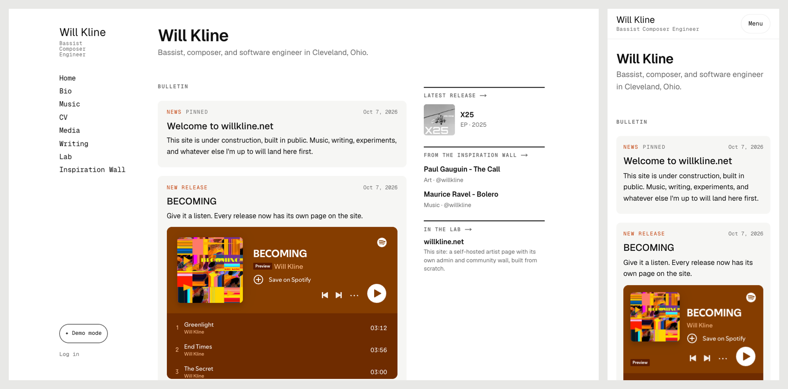

# willkline.net

The personal site of **Will Kline**: bassist, composer, and software engineer. **Live at [willkline.net](https://willkline.net).**

It's a nod to the self-hosted soloist websites of the early web (a sidebar, a few honest pages, no template), built as a small but complete web application with its own admin, file storage, and a community board.



## What it does

- **Bulletin-board home page.** Shows, releases, and notes with photos, flyers, PDFs, and embedded YouTube / Vimeo / Spotify / SoundCloud players, next to a column that fills itself in from every other section.
- **Music catalog.** Every release with cover art, track list, year, and platform links, filterable by type.
- **Writing.** Markdown posts with one lead picture or video, plus search and sorting.
- **Media.** A photo grid with a CSS-only lightbox, and embedded videos.
- **A living CV.** The page *is* the CV. Downloadable documents (résumé, CV, anything else) are uploaded and titled from the admin, with no redeploy.
- **Inspiration Wall.** Members share and save art, music, and video. It has per-person reporting with auto-hide, author editing, image uploads, admin moderation, closable sign-ups, and honeypot/time-trap bot protection.
- **Admin for everything**, designed to be used from a phone.

## How it's built

| Layer | Choice |
| --- | --- |
| Framework | **Next.js 16** (App Router, Server Components, Server Actions), **React 19**, **TypeScript** |
| Styling | **Tailwind CSS 4** plus hand-written CSS ("Quiet Studio" theme), mobile-first |
| Data | **PostgreSQL** via **Prisma 6** (engine-less client with `@prisma/adapter-pg`). **Neon** in production, Homebrew Postgres locally |
| Files | **Vercel Blob** (private) in production, local disk in development, behind one storage interface |
| Images | **sharp**: auto-rotate, resize, re-encode to WebP, strip metadata (e.g. GPS) |
| Markdown | **react-markdown** + remark-gfm, with raw HTML disabled |
| Hosting | **Vercel**. Pushing to `main` deploys, and production builds run `prisma migrate deploy` first |
| Testing | **Playwright** (Python) end-to-end suites, a responsive layout audit, **Lighthouse**, **ESLint** |

Design notes worth reading in the code:

- **Hand-rolled auth** (`src/lib/auth.ts`). Passwords use scrypt. Sessions live in the database, and only a SHA-256 hash of each token is stored. Cookies are httpOnly. Failed logins are throttled. `requireAdmin()` guards every admin page *and* every Server Action.
- **One door for files** (`src/app/uploads/[key]/route.ts`). Every upload has a database row and is streamed through a single route, so privacy rules (drafts, hidden posts) live in one place. Files are served `Cache-Control: private`, so deletions take effect immediately.
- **Allowlisted embeds** (`src/lib/embeds.ts`). Only known players become iframes; every other URL becomes a plain link card.
- **Content lives in the database**, editable from the admin. The seed script is *fill-only*: it never overwrites live edits.
- **Link previews** are generated at build time (`src/app/opengraph-image.tsx`). Release and post pages use their own artwork.

More detail: [`docs/DECISIONS.md`](docs/DECISIONS.md) (why things are the way they are), [`docs/DESIGN.md`](docs/DESIGN.md), [`docs/PLAN.md`](docs/PLAN.md), and [`docs/STATUS.md`](docs/STATUS.md) (dated build log).

## Run it locally

Requirements: Node 20+, PostgreSQL (e.g. `brew install postgresql@17`), and Google Chrome for the browser tests.

```bash
createdb willkline
cp .env.example .env          # set USER in the connection strings
npm install                   # also generates the Prisma client
npx prisma migrate deploy     # create the schema
npm run db:seed               # sample content: music catalog, bio, CV, example posts
npm run admin:create          # prompts for an admin email + password
npm run dev                   # http://localhost:3000
```

## Tests

The suites run against a production build on port 3123:

```bash
npm run build && npx next start -p 3123 &
pip install playwright
python scripts/e2e_admin.py        # login, bulletin, documents, bio, CV, music + track lists, media, writing, lab
python scripts/e2e_wall.py         # sign-up, posting, images, editing, saving, reports, moderation, sorting
python scripts/responsive_audit.py # every page at 4 screen sizes: overflow, tap targets, text size
```

Each test cleans up after itself, deleting uploads through the app so no files are orphaned.

## Rights

The code is here to read and learn from. The music, writing, photos, and other content on the site are © Will Kline, all rights reserved.
